# Production-Grade Kubernetes Monitoring

A Prometheus/Grafana observability stack built around a two-service Kubernetes application (Java/Spring Boot + Python/Flask), designed around Kubernetes-native service discovery.

> **Scope note:** this is a production-*oriented* monitoring design, validated in a local `kind` cluster

## Overview

Two services: an order API (Java/Spring Boot) and a payment service (Python/Flask), run in a local multi-node Kubernetes cluster. Each is instrumented to expose Prometheus metrics for request volume, error rate, latency, and resource usage. A Prometheus Operator managed stack discovers both services through `ServiceMonitor` custom resources, evaluates alerting rules against their metrics, and a Grafana dashboard surfaces the resulting signals for an operator.

The project was built to demonstrate the full observability lifecycle: instrument, discover, collect, alert, visualize, and validate.

## Architecture

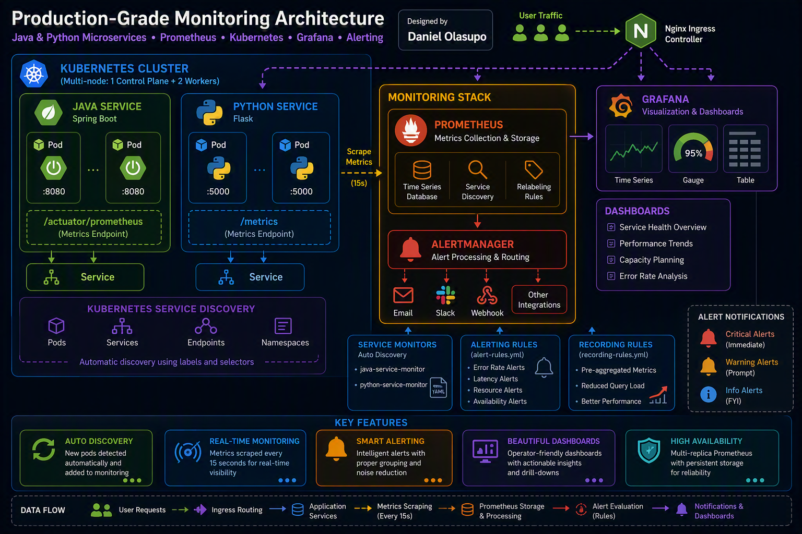

## Technology Stack

| Layer | Technology |
|---|---|
| Cluster | kind (Kubernetes-in-Docker), 1 control-plane + 2 workers |
| Ingress | NGINX Ingress Controller |
| Application (Java) | Spring Boot, Micrometer, Spring Boot Actuator |
| Application (Python) | Flask, `prometheus_client`, Gunicorn |
| Metrics collection | Prometheus (via Prometheus Operator / kube-prometheus-stack) |
| Service discovery | Kubernetes `ServiceMonitor` CRDs |
| Alerting | Prometheus `PrometheusRule` CRDs, Alertmanager |
| Dashboards | Grafana |
| Load generation | `hey` |

## Kubernetes Infrastructure

The cluster is provisioned via `kind` with an explicit multi-node topology (`cluster-config.yaml`). This matters because Kubernetes service discovery and pod scheduling behave differently across nodes than on a single node, and the monitoring design needs to hold up in that reality.

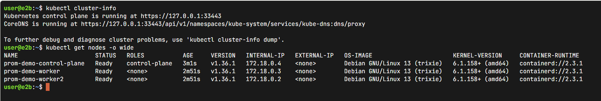

Application workloads run in a dedicated `monitoring-demo` namespace, separate from the `monitoring` namespace hosting Prometheus/Grafana/Alertmanager, a deliberate separation of application and platform concerns.

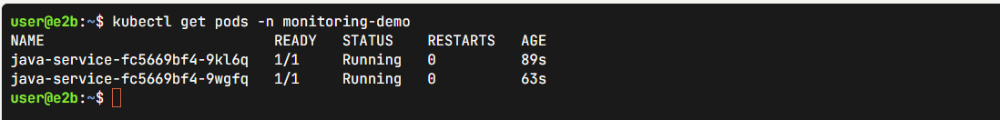

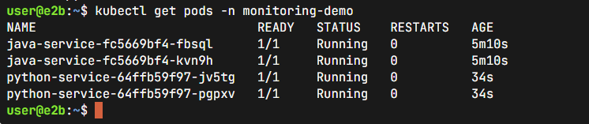

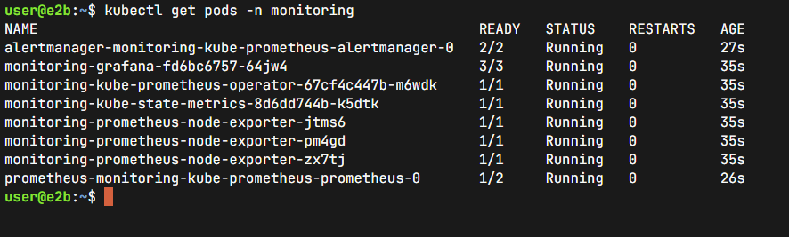

NGINX Ingress routes external traffic to both services under path-based rules (`/java`, `/python`).

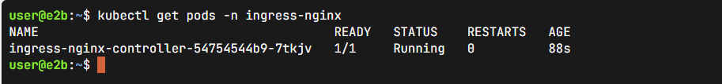

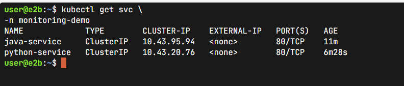

Each service is fronted by a Kubernetes `Service` object; these are the objects `ServiceMonitor` selectors target.


## Application Instrumentation

Both services expose the same four metric shapes, chosen to answer the core operational questions (is it up, is it fast, is it failing, is it resource-constrained) rather than instrumenting arbitrarily.

**Java (Spring Boot / Micrometer):**
- `order_requests_total` (Counter): request volume
- `order_errors_total` (Counter): errors, incremented in a `@RestControllerAdvice` global exception handler
- `order_request_latency_seconds` (Histogram, via `@Timed(histogram = true)`): request latency, exposed with bucket data so `histogram_quantile()` works
- `process_cpu_usage`, `jvm_memory_used_bytes` (Gauges): provided automatically by Micrometer/Actuator, no custom code required
- Exposed at `/actuator/prometheus`

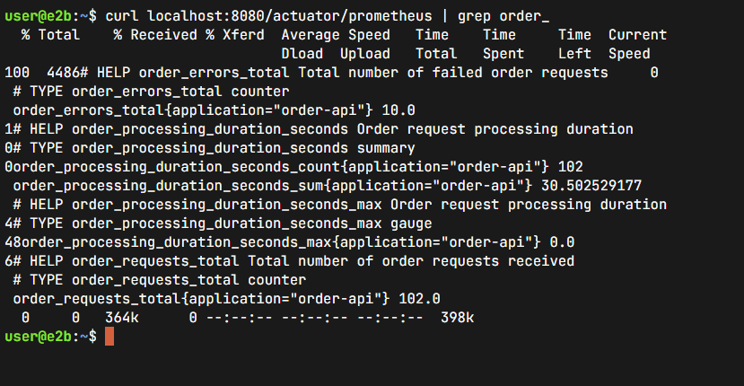

**Python (Flask / prometheus_client):**
- `payment_requests_total` (Counter, labeled by status): request volume
- `payment_errors_total` (Counter): errors
- `payment_request_latency_seconds` (**Histogram**, not Summary): latency. A `Summary` was deliberately avoided here because Summary quantiles can't be aggregated across pods or queried with `histogram_quantile()`, which the dashboard and alert rules depend on.
- `process_cpu_usage_percent`, `process_memory_usage_bytes` (Gauges, via `psutil`, sampled on a background thread)
- Exposed at `/metrics`

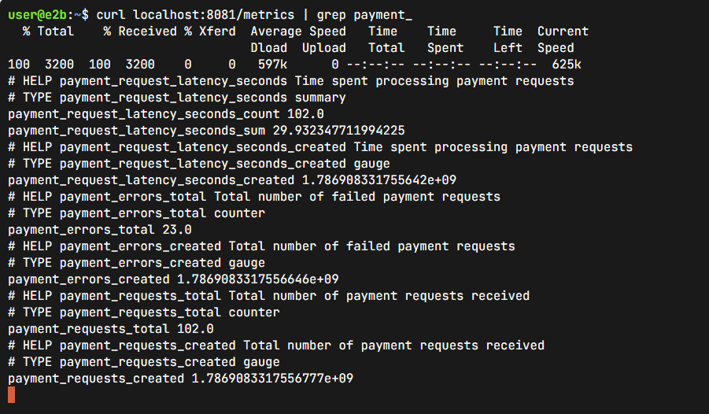

## Prometheus & ServiceMonitor Architecture

Prometheus is deployed via the Prometheus Operator (kube-prometheus-stack), rather than a bare Prometheus binary with a static `scrape_configs` file. This means scrape targets are derived declaratively from Kubernetes objects (`ServiceMonitor` -> `Service` -> `Endpoints`) instead of hardcoded IPs.

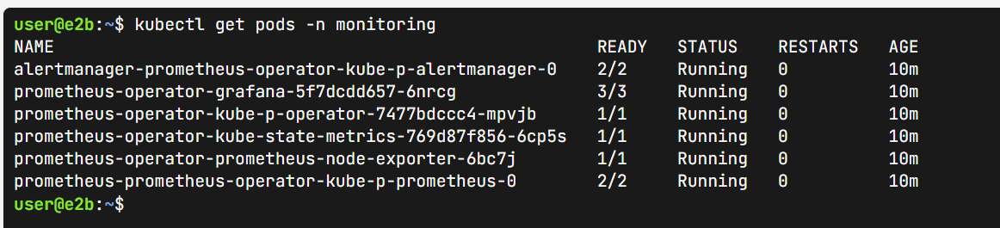

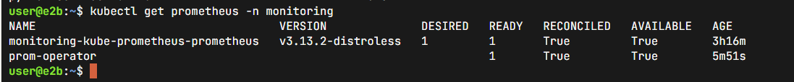

A `ServiceMonitor` exists per service, each defining the scrape port, metrics path, interval, and relabeling to attach `namespace`/`cluster` labels consistently across both services' metrics, important for writing PromQL that isn't service-specific string matching.

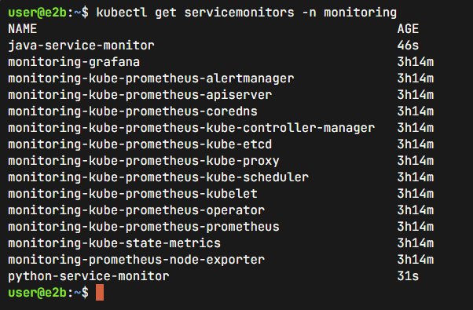

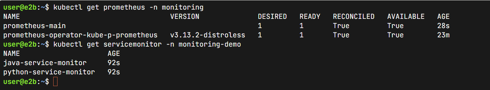

The Prometheus custom resource's `serviceMonitorNamespaceSelector` is intentionally left empty (cluster-wide), since application services live in a different namespace than Prometheus itself.

## Kubernetes Service Discovery

This is the core competency the project demonstrates: rather than a static list of scrape targets, Prometheus uses the `endpoints` and `pod` Kubernetes SD roles under the hood (abstracted via `ServiceMonitor`) to continuously reconcile its scrape target list against the live state of the cluster.

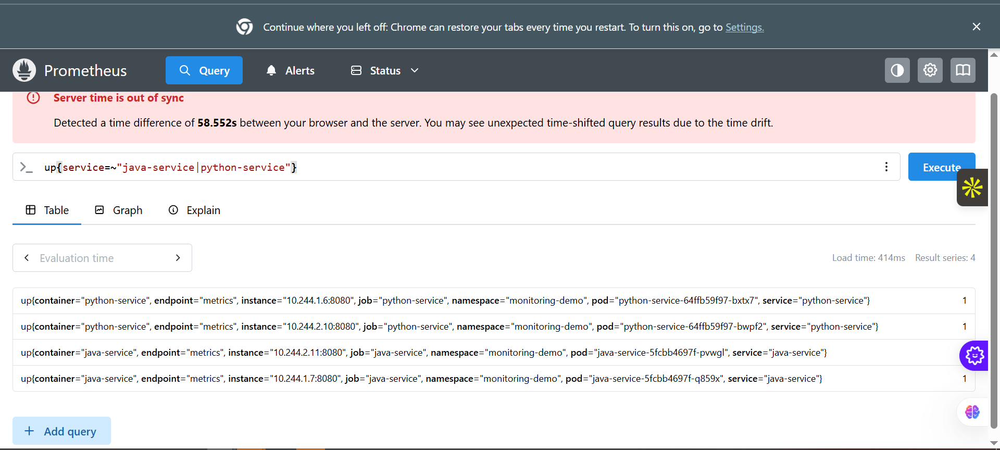

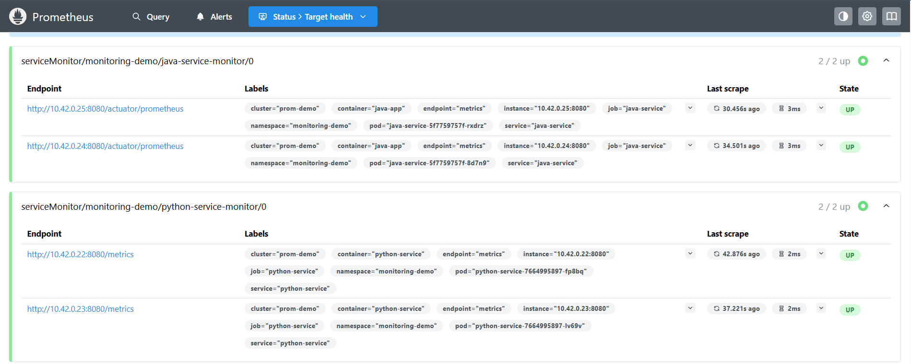

This was validated directly: scaling the Python service's replica count produced additional scrape targets in Prometheus without any manual configuration change.

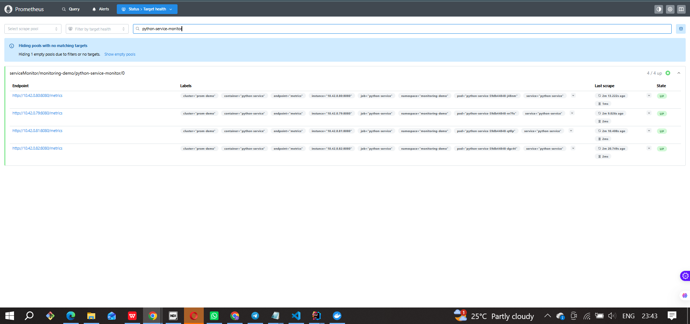

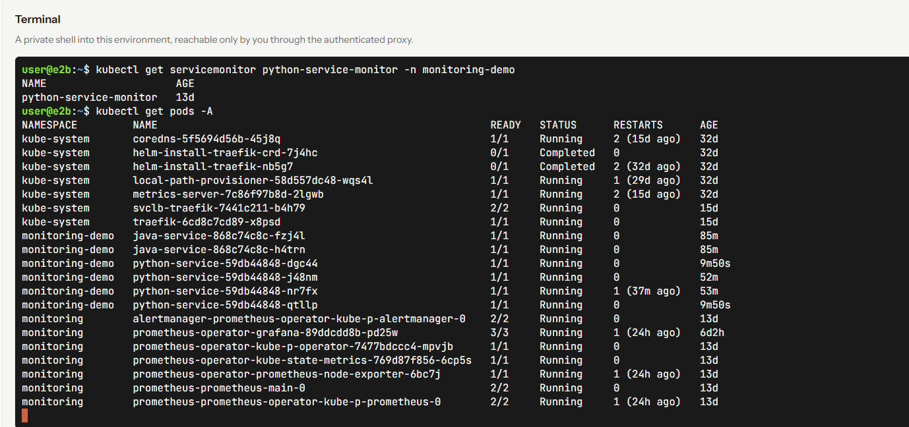

## Alerting Strategy

Alerting rules are deployed as a `PrometheusRule` CRD, grouped per service, covering:

- **Error rate**: `sum(rate(errors[5m])) / sum(rate(requests[5m])) > 0.05`, `for: 5m`
- **p95 latency**: `histogram_quantile(0.95, sum(rate(*_bucket[5m])) by (le)) > 1.0`, `for: 10m`
- **CPU / memory**: resource gauges compared against fixed thresholds, `for: 10m`
- **Target availability**: `up{job="..."} == 0`, `for: 2m`

Every rule uses a `for:` duration rather than firing on the instant a threshold is crossed. This avoids alert noise from momentary spikes and reflects how these thresholds would actually be used operationally.

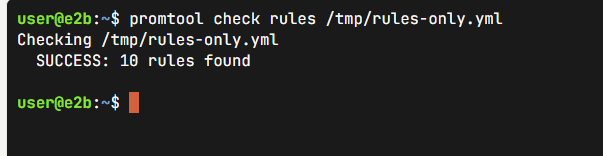

> This screenshot confirms the rules are syntactically valid and loaded by Prometheus. It does not by itself confirm an alert has fired under real failure conditions.

## Grafana Dashboard

Grafana is deployed with the monitoring stack and preconfigured to use Prometheus as its data source. The dashboard includes a service-health gauge, request-rate and error-rate time series, p95 latency panels, resource-usage panels, and a top-endpoints-by-latency table, with `namespace`/`service` template variables for filtering.

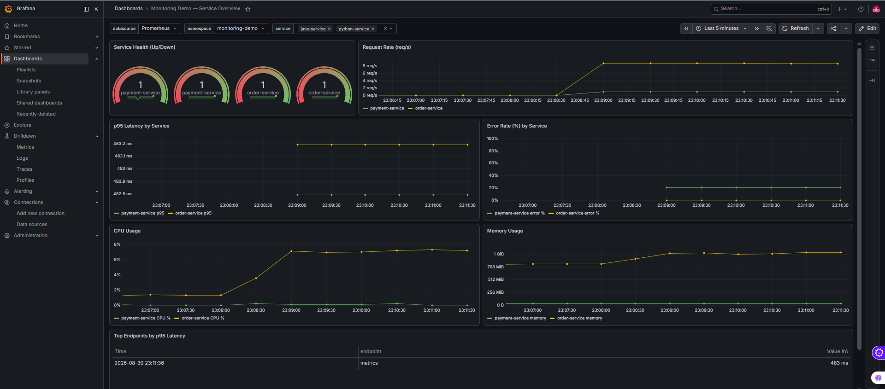

## Monitoring Validation

Validation was approached in layers rather than assuming a deployed stack works correctly:

1. **Target validation**: confirming Prometheus's `/targets` page shows both services UP, not just that `ServiceMonitor` YAML applied cleanly.
2. **Discovery validation**: scaling a Deployment and confirming new targets appear automatically, proving the discovery mechanism (not just the initial static state) works.
3. **Load validation**: generating synthetic HTTP traffic with `hey` against both services to confirm metrics respond to real request volume.

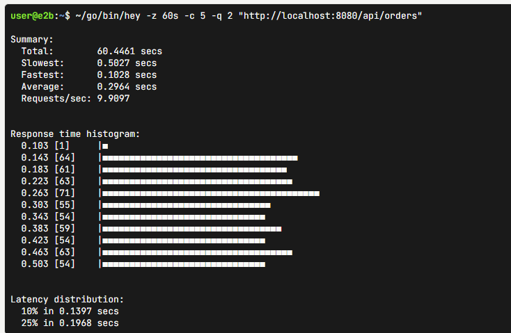

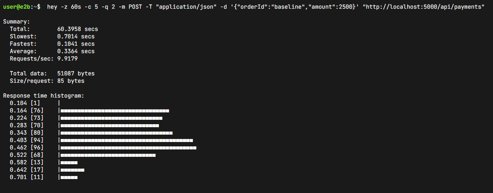

> Failure-injection scenarios (forced error rates, latency spikes, pod deletion) and end-to-end Alertmanager delivery were part of the test plan for this project.

## Load Testing

Baseline HTTP load was generated with `hey` against both `/api/orders` and `/api/payments` to confirm request-volume and latency metrics reflect real traffic, not just static/idle values.

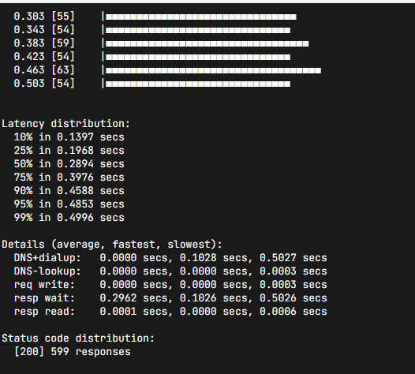

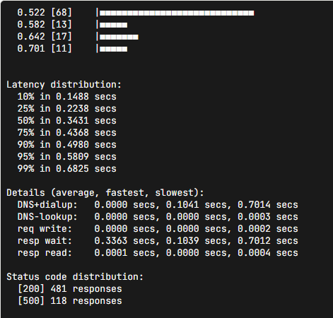

## What the Project Demonstrates

- Multi-node Kubernetes cluster provisioning and namespace-based separation of application and platform concerns
- Application-level Prometheus instrumentation across two different language runtimes (JVM and Python)
- Correct metric-type selection (Histogram vs Summary) based on downstream query requirements, not just default library usage
- Kubernetes-native service discovery via the Prometheus Operator's `ServiceMonitor` CRD
- PromQL rule design with rate/aggregation functions and `for:` durations to reduce alert noise
- Dashboard design translating raw metrics into operator-facing health, performance, and capacity signals
- A validation methodology that treats "the config applied" and "the system actually works" as different claims

## Production Considerations

What this project does **not** claim, and what a real production deployment would add:

- **High availability**: single-replica Prometheus/Alertmanager here; production would run Prometheus in HA pairs or use Thanos/Cortex for long-term storage and dedup.
- **Multi-cluster**: this project is single-cluster; the brief's federation/Thanos stretch goal was not implemented.
- **Alertmanager routing/notification**: routing to Slack/PagerDuty/email was not configured or tested in this build; alerts were validated at the Prometheus rule-evaluation level only.
- **Capacity forecasting**: dashboard panels show current resource usage; no forecasting/trend-projection was implemented.
- **TLS, authentication, RBAC hardening**: out of scope for this local demo environment.

## Repository Structure

```
.
├── screenshots/
├── cluster-config.yaml
├── k8s/
│   ├── java-service-deployment.yaml
│   ├── python-service-deployment.yaml
│   ├── ingress.yaml
│   ├── servicemonitor-java.yaml
│   └── servicemonitor-python.yaml
├── java-service/
│   ├── pom.xml
│   └── src/main/java/com/example/orderapi/...
├── python-service/
│   ├── requirements.txt
│   ├── app/
│   └── Dockerfile
├── prometheus-config/
│   ├── prometheus.yaml
│   ├── servicemonitor-java.yaml
│   └── servicemonitor-python.yaml
├── prometheus/
│   ├── alert-rules.yml
│   └── prometheus-config.yaml
├── grafana/
│   └── grafana-dashboard.json
└── test-report.md
```

## Getting Started

```bash
# 1. Create the cluster
kind create cluster --name prom-demo --config cluster-config.yaml

# 2. Install the Prometheus Operator stack
helm repo add prometheus-community https://prometheus-community.github.io/helm-charts
helm install prometheus-operator prometheus-community/kube-prometheus-stack \
  --namespace monitoring --create-namespace \
  --set prometheus.prometheusSpec.serviceMonitorSelectorNilUsesHelmValues=false

# 3. Deploy the application
kubectl create namespace monitoring-demo
kubectl apply -f k8s/

# 4. Deploy monitoring config
kubectl apply -f prometheus-config/
kubectl apply -f prometheus/alert-rules.yml

# 5. Verify
kubectl port-forward -n monitoring svc/prometheus-operated 9090:9090
# open http://localhost:9090/targets
```